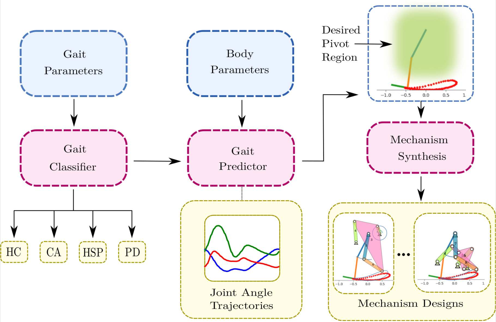
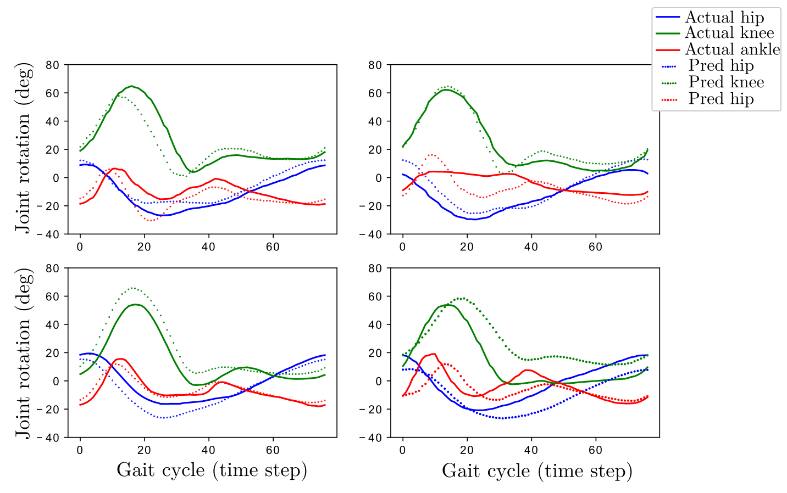
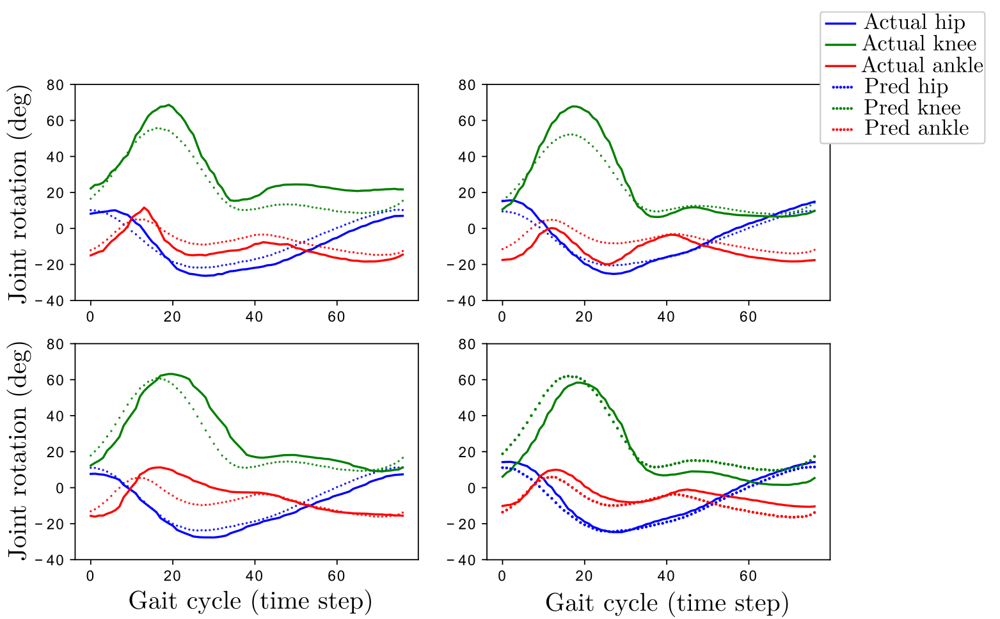
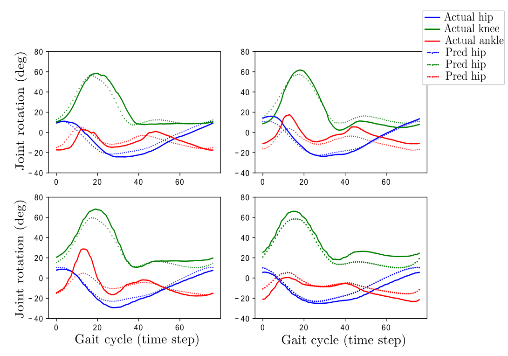
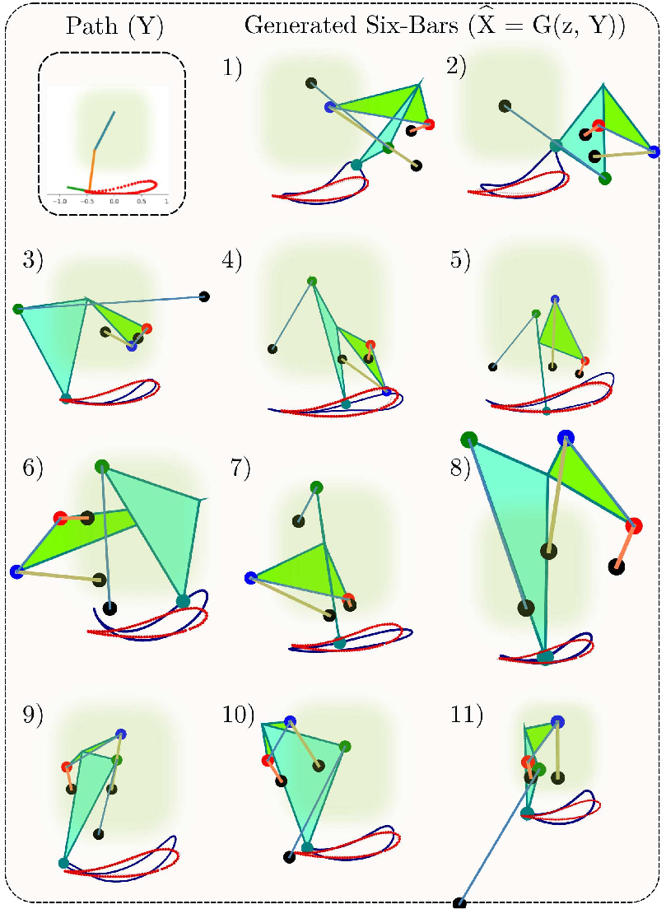
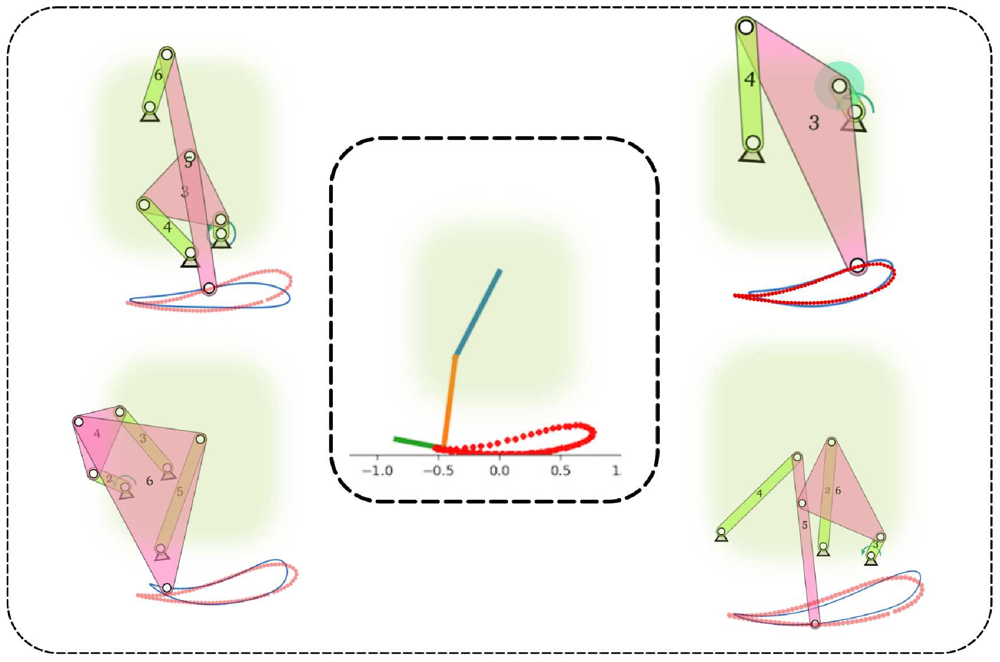
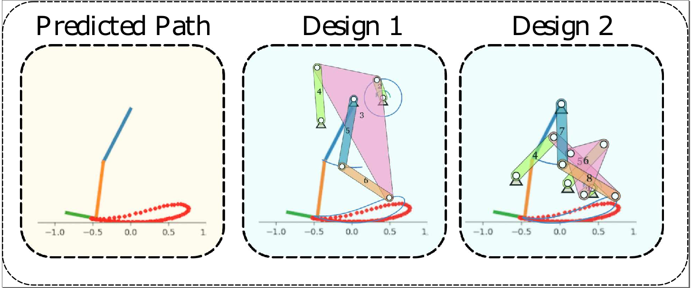

# Machine Learning Driven Individualized Gait Rehabilitation: Gait Classification, Prediction, and Mechanism Design

End-to-End computational approach for individualized gait rehabilitation using machine learning techniques for gait classification using classification models, gait prediction using regression models, and specialized device design.
 

The initial component of our End-to-End approach is the Gait Classifier Module, which analyzes the current gait of the individual on which various further actions are dependent. The inputs to the gait classifier are 22 gait parameters of an individual and the output is corresponding label of gait type. Their are a total of 238 samples with gait parameters and gait label. Gait classification is carried out using K-nearest neighbors, Support Vector Machines, Artificial Neural Network, and Random Forests to classify the gaits into healthy, Cerebellar Ataxia (CA), Hereditary Spastic Paraparesis (HSP), and Parkinson’s disease (PD). Leave one out and k-fold cross-validation methods is used to find out the performance of the classification models.

The following table gives the classification accuracies of the models with different cross-validations:

| Method  | LOO CV | 3-fold CV  | 5-fold CV | 7-fold CV |
| ------------- | ------------- | ------------- | ------------- | ------------- |
| KNN  | 78.57%  | 71.04%  | 78.55%  | 78.99%  |
| SVM  | 88.23%  | 83.18%  | 86.55%  | 87.81%  |
| ANN  | 89.49%  | 83.58%  | 90.16%  | 88.65%  |
| RF   | 98.47%  | 93.60%  | 92.42%  | 95.79%  |

The goal of gait prediction is to be able to predict the gait trajectories for a given individual. In order to be able to do that, we first map the healthy individuals' gaits to their attributes. The input for our models are the age, height, weight, gender, thigh length, shank length, and eight other lower leg parameters and the output are their corresponding lower limb joint angle trajectories of hip, knee, and ankle over a gait cycle. Polynomial, Artificial Neural Network, and Lasso regression models are used to train the model for multivariate time series prediction of the joint angles. The standard Root Mean Square Error (RMSE) is used as the performance evaluation parameter for the regression models. Again, Leave one out and k-fold cross-validation methods is used to find out the performance of the regression models.

The following table gives the Root Mean Square Error (RMSE) of the regression models with different cross-validations:

| Method  | LOO CV | 3-fold CV  | 5-fold CV | 7-fold CV |
| ------------- | ------------- | ------------- | ------------- | ------------- |
| Polynomial  | 12.09  | 12.88  |  13.42  | 13.81  |
| ANN  |  9.27  |  8.13  | 9.52  |  9.78  |
| Lasso  | 7.008 |  7.43  |  7.44  |  7.40  |

Comparison of the predicted and the actual angle trajectories for the joints by Polynomial regression:

Comparison of the predicted and the actual angle trajectories for the joints by ANN regression:

Comparison of the predicted and the actual angle trajectories for the joints by Lasso-regression:

Once the gait required for training the individual depending upon their body paramters is obtained, the design process for different mechanisms for gait rehabilitation is initiated. Deep generative model takes in the input the ankle gait trajectory/coupler curve and outputs different variations of 1-dof mechanisms that would give similar coupler curve as our input trajectory. Conditional-Variational Auto Encoders (C-VAE) are used for this problem.

The figure below shows some of the mechanism designs generated for the given ankle trajectory by the C-VAE:

According to the compactness, needs and ease of use for the patient, the different mechanisms that are obtained previously are filtered and we chose the most feasible 1-dof mechanisms. We also apply the condition of the fixed pivots are in the desired shaded regions show in the figure.

Following are the feasible solution concepts of mechanisms:

Along with Six-bars, C-VAE model was also used to find out the suitable four-bar linkages.

The figure below shows the final solution concepts of four-bar linkages along with an additional 2R link which resembles the thigh and lower leg of the person.

The mechanism generated would help the subject train to walk a normal gait trajectory specific to their body parameters and thus aid in gait rehabilitation of the patient.
